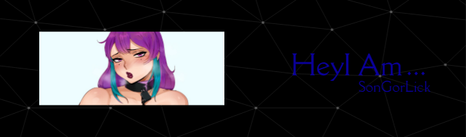
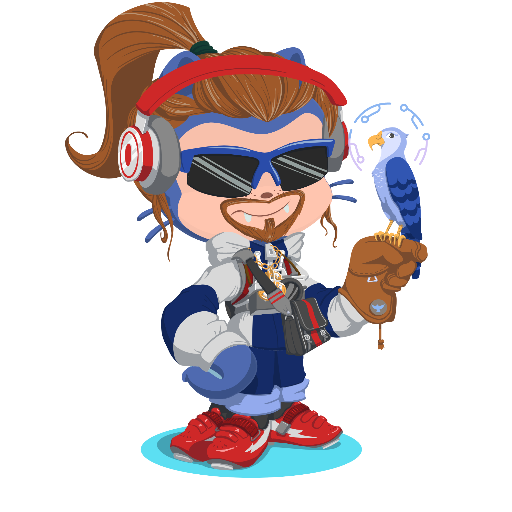

<body>
<h1 align="center">~ 💖 𝓦𝓮𝓵𝓬𝓸𝓶𝓮 𝓽𝓸 𝓶𝔂 𝓟𝓻𝓸𝓯𝓲𝓵𝓮 💖 ~</h1>
 

 

<h2 align="center"> 🦊 ~ 𝓐𝓫𝓸𝓾𝓽 𝓶𝓮 ~ 🦊 </h2>

<li>
<b>Name:</b> Sasaki Michie>
<li>
<b>Nationality:</b> Anime God
</li>
<li>
<b>Loves:</b> Waifu's! and Anime and games maybe -///-
</li>
<li>
<b>Gender:</b> Him/He/Male
</li>
<li>
<b>Hobbys:</b> Tech Stuff, Graphics Design, Music, Anime, Gaming, Drawing
</li>
<li>
<b>Working On @:</b> Making Mods For Game's 
</li>
 

<b>     Thanks fow weading this onyee-san 
                  verwy cuwute of chu</b>

<h2 align="left">            ~ 📇 𝓚𝓷𝓸𝔀𝓵𝓮𝓭𝓰𝓮 📇 ~</h2>

    
     
      
       
         
          
           
            
             
             
             
             
             
             
              

Im also very good at writing Guides Ill End Up Making Some Soon or writing this shit here. Literally took me Hours to write this while listeing to music. Also good @ Graphics Design, I'm Good At Making AMV'S, I'm good at making models as well as mods for games and im decent at coding.

 
<h2>           📝 ~ 𝓒𝓸𝓷𝓽𝓪𝓬𝓽 𝓶𝓮 ~ 📝</h2>

 

Hewe awe some of my  
most used s-s-sociaw things >~< xoxox

 

 

<h2 align="center" style="font-size: 24px">~ 📻 𝓒𝓾𝓻𝓻𝓮𝓷𝓽 𝓙𝓪𝓶 📻 ~</h2>
 

 

 

 
 

<h2 align="center">💖 ~ 𝓣𝓱𝓪𝓷𝓴𝓼 𝓯𝓸𝓻 𝓻𝓮𝓪𝓭𝓲𝓷𝓰! ~ 💖</h2>

 
 

</body>
